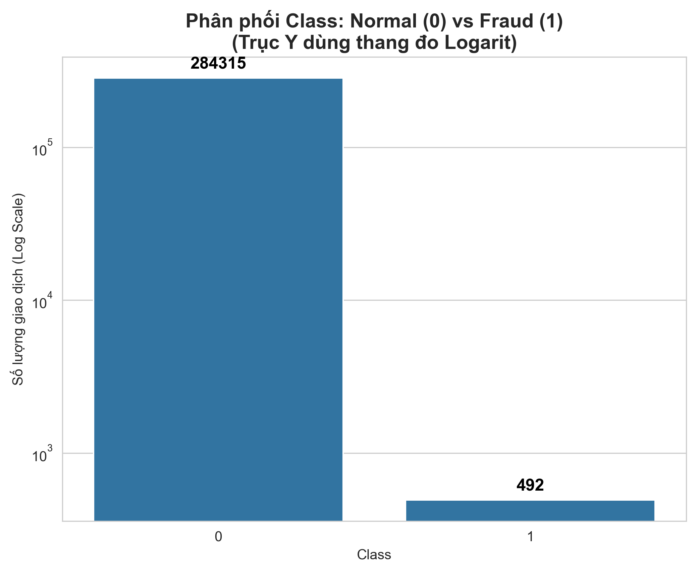
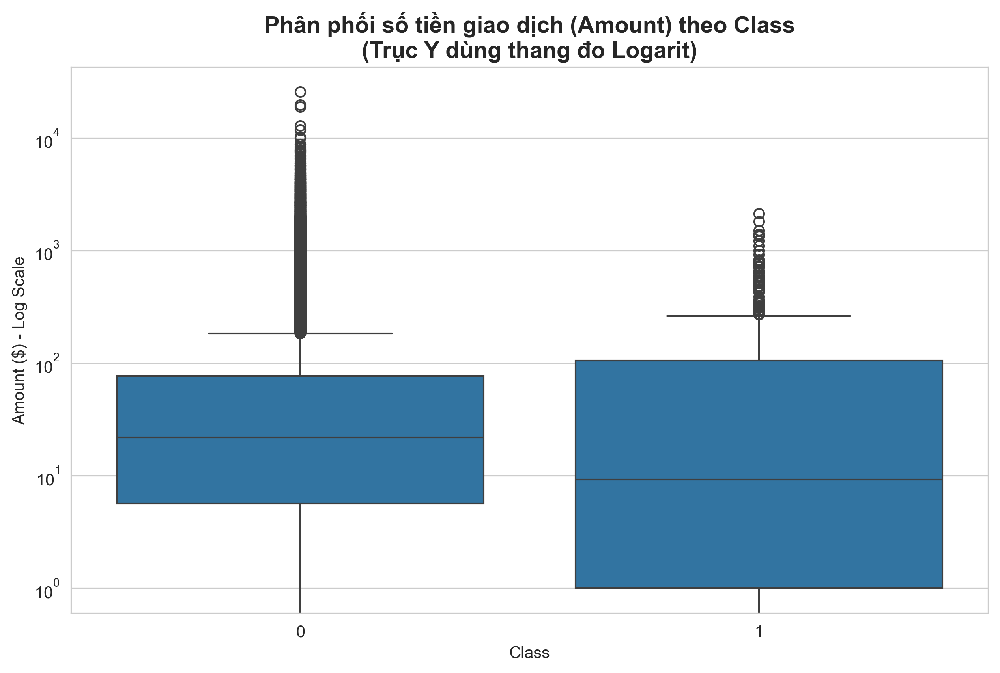
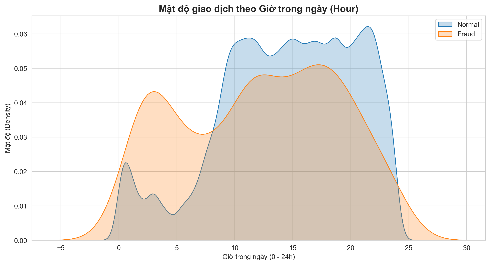
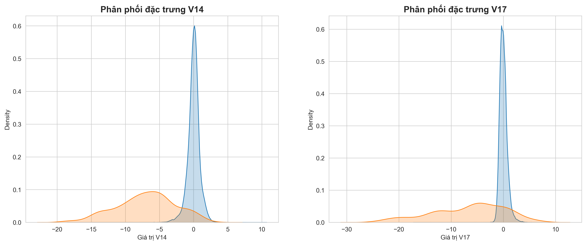

# Fraud Detection API

A production-ready **FastAPI** service for real-time and batch credit-card fraud detection, powered by an **XGBoost** classifier trained on the ULB Credit Card Fraud dataset.

---

## API Overview

All endpoints are versioned under `/api/v1`.

| Method | Endpoint | Description |
|--------|----------|-------------|
| `GET` | `/api/v1/health` | Model health / readiness check |
| `POST` | `/api/v1/predictions` | Classify a single transaction |
| `POST` | `/api/v1/predictions/batch` | Classify up to 100 transactions |

Interactive docs (Swagger UI) → `http://localhost:8000/docs`

---

## Exploratory Data Analysis (EDA)

Below are some key insights from the dataset analysis:

### 1. Class Distribution
The dataset is highly imbalanced, with only **473** fraud cases out of **284,807** transactions (~0.17%).



### 2. Transaction Amount vs Class
Fraudulent transactions often have different amount distributions compared to legitimate ones.



### 3. Transaction Density by Hour
Analysis of transaction frequency over a 24-hour cycle.



### 4. Key Feature Separability
Features like `V14` and `V17` show significant differences in distribution between fraud and normal classes, making them strong predictors.



---

## Project Structure

```
Fraud-Classification-System/
├── app/
│   ├── api/
│   │   └── v1/
│   │       ├── health.py        # GET /api/v1/health
│   │       ├── predictions.py   # POST /api/v1/predictions[/batch]
│   │       └── router.py        # v1 router aggregator
│   ├── models/
│   │   └── schema.py            # Pydantic request / response models
│   ├── services/
│   │   └── model_service.py     # Preprocessing + inference
│   └── main.py                  # FastAPI app factory + global error handlers
├── scripts/
│   ├── train.py                 # Training pipeline
│   ├── setup_models.py          # Auto-download models from Google Drive
│   └── generate_eda_plots.py    # Generate EDA plots for documentation
├── models/                      # Saved artifacts (gitignored)
├── data/                        # Raw CSV data (gitignored)
├── tests/
│   ├── conftest.py              # Shared fixtures
│   ├── test_api.py              # Integration tests
│   ├── test_service.py          # Unit tests – ModelService
│   └── test_schemas.py          # Unit tests – Pydantic schemas
├── Dockerfile                   # Docker image definition
├── requirements.txt
└── .env
```

---

## Setup

### 1. Install dependencies
```bash
pip install -r requirements.txt
```

### 2. Prepare Models
The models are stored in Google Drive to keep the repository lightweight. You can download them automatically:
```bash
python scripts/setup_models.py
```
Alternatively, the Docker build and CI/CD pipeline handle this automatically.

### 3. Prepare Data (Optional)
If you want to retrain the model, place the `creditcard.csv` file in the `data/` directory and run:
```bash
python scripts/train.py
```

### 4. Start the server
```bash
uvicorn app.main:app --reload
```

---

## Docker Support

Build and run the application using Docker:
```bash
docker build -t fraud-detection-api .
docker run -p 8000:8000 fraud-detection-api
```
The Docker image automatically downloads the latest model artifacts during the build process.

---

## API Reference

### `GET /api/v1/health`

Returns model readiness.

```json
{
  "status": "ok",
  "model_loaded": true,
  "version": "1.0.0"
}
```

---

### `POST /api/v1/predictions`

Classify a single transaction.

**Request body:** 30 numeric fields — `Time`, `V1`–`V28`, `Amount`.

```json
{ "Time": 406.0, "V1": -2.31, ..., "Amount": 149.62 }
```

**Response `200 OK`:**
```json
{
  "data": {
    "is_fraud": false,
    "probability": 0.02,
    "model_version": "xgboost-v1"
  }
}
```

---

### `POST /api/v1/predictions/batch`

Classify 1–100 transactions in one call.

**Request body:**
```json
{
  "transactions": [
    { "Time": 406.0, "V1": ..., "Amount": 149.62 },
    { "Time": 812.0, "V1": ..., "Amount": 0.0 }
  ]
}
```

---

## Running Tests

```bash
pytest tests/ -v
```

---

## CI/CD Pipeline

The project includes a GitHub Actions pipeline (`.github/workflows/ci-cd.yml`) that:
1. Lints code with Ruff.
2. Downloads models and runs tests.
3. Builds and pushes a Docker image to Docker Hub on every push to `main`.
